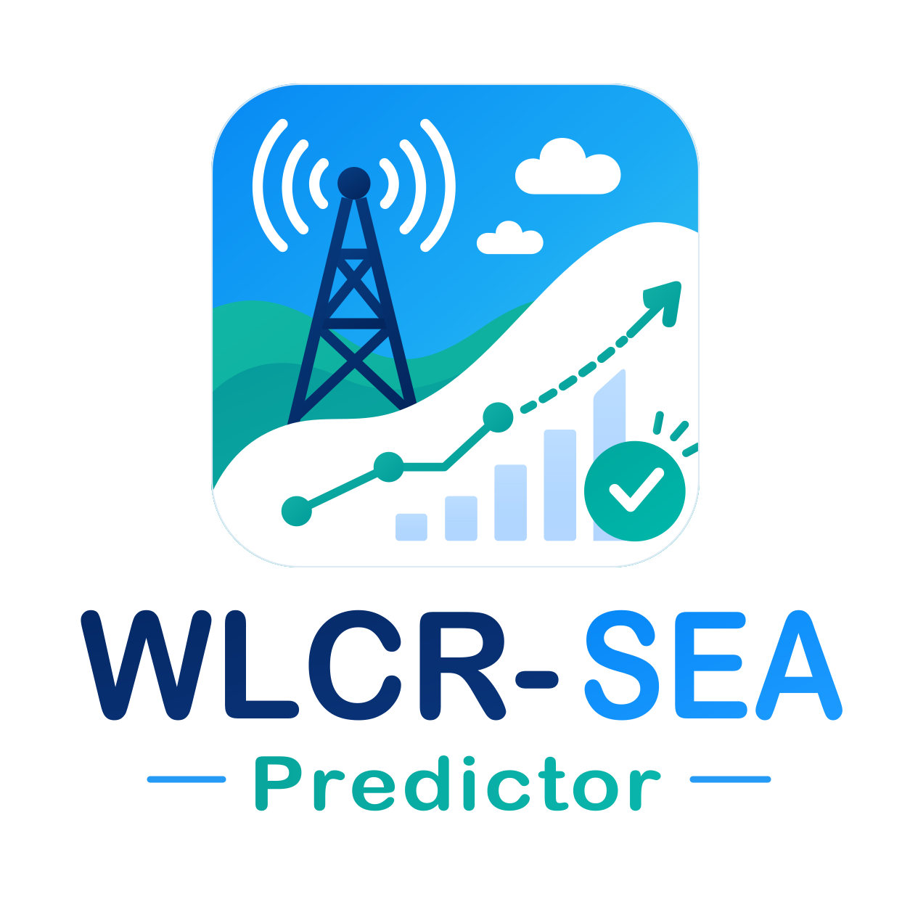
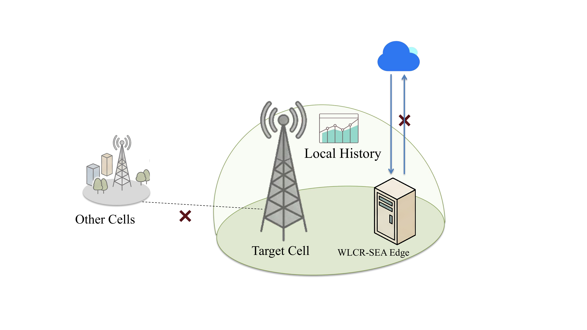
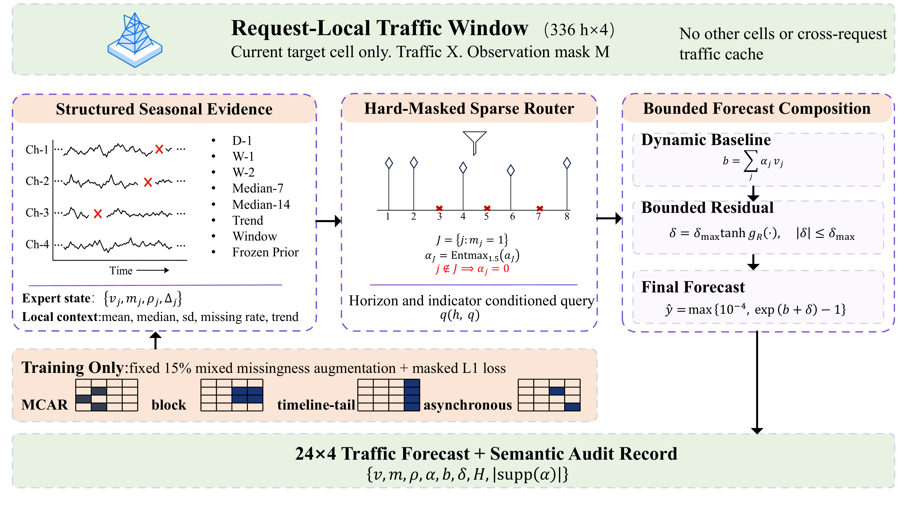
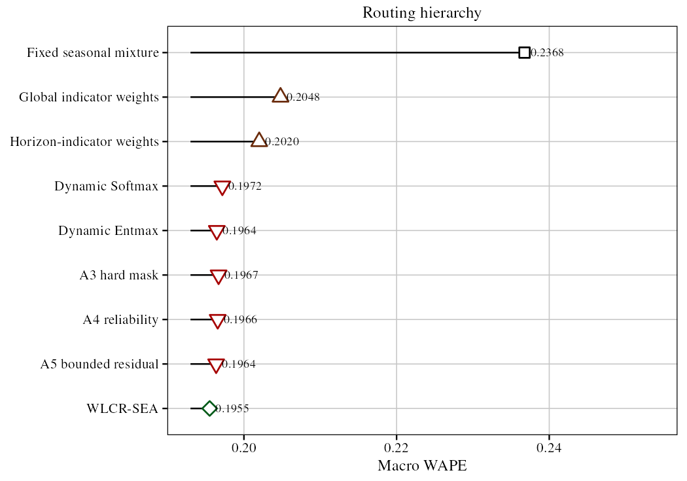
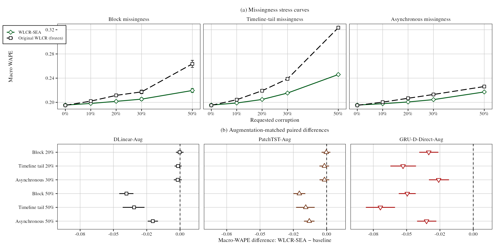
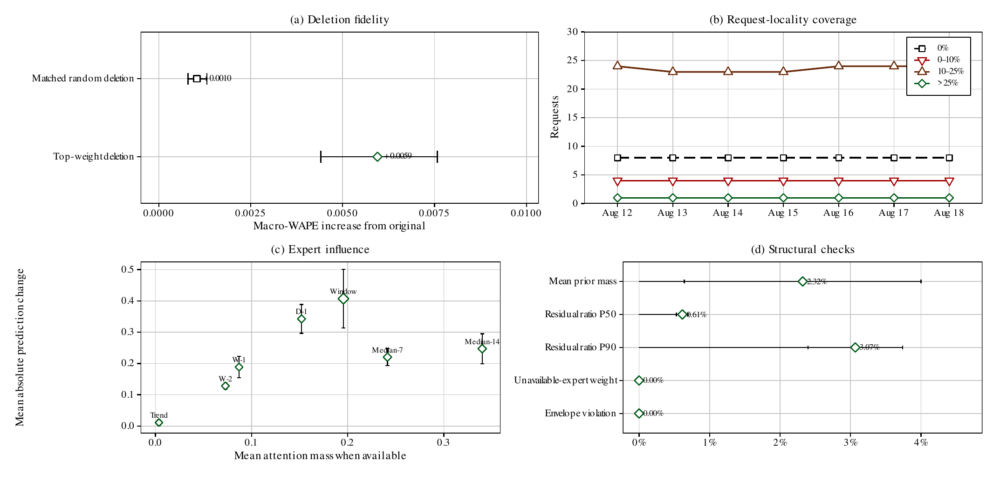

  <picture>
    <source media="(prefers-color-scheme: dark)" srcset="docs/assets/brand/logo-dark.svg">
    <source media="(prefers-color-scheme: light)" srcset="docs/assets/brand/logo.svg">
    
  </picture>

<h1 align="center">WLCR-SEA Predictor</h1>

  <strong>只使用单个小区的近期数据，预测其未来 24 小时流量</strong> 
  WLCR-SEA 的开源代码、论文结果与交互 Demo。

  <a href="README.md">English</a> · <a href="README_CN.md">简体中文</a>

  
  
  
  
  

  <a href="https://rudykon.github.io/WLCR-SEA_Predictor/zh/">项目网站</a> ·
  <a href="https://huggingface.co/spaces/config-h/WLCR-SEA_Predictor">在线 Demo</a> ·
  <a href="#overview">概览</a> ·
  <a href="#method">方法</a> ·
  <a href="#figures">图件</a> ·
  <a href="#quick-start">快速开始</a> ·
  <a href="#validation">验证</a> ·
  <a href="#resources">资源</a>

## 概览

假设运营人员需要预测某个小区明天的流量。由于访问权限或系统隔离要求，模型只能读取
本次提交的小区数据，不能临时查询邻近小区的实时流量。

WLCR-SEA（Window-Local Context Representation with Seasonal Expert Attention）
面向这一场景设计。它读取该小区过去 14 天（336 小时）的四项流量指标，预测未来
24 小时。如果部分历史数据缺失，方法会排除依赖这些数据的参考项，而不会把填充值当成
真实观测。

模型还会给出每次预测参考了哪些历史规律、各自占多大权重。这让结果更容易检查，也便于
以后使用相同输入重新计算。

**基本输入与输出：**

- **输入：**单个小区连续 336 行小时数据，包含四项流量指标。
- **输出：**同四项指标未来 24 小时的预测。
- **缺失数据：**无法计算的历史参考项权重严格为零。
- **结果检查：**可导出候选值、权重和预测范围检查记录。

## 方法

WLCR-SEA 会针对每个未来小时和每项指标生成八个**候选预测**。论文称它们为“专家”，
但这里的专家并不神秘，本质上就是依据不同历史规律给出的候选值。

| 候选预测 | 使用的数据 |
| --- | --- |
| 前一天 | 前一天的同一小时 |
| 前一周 | 前一周的同一小时 |
| 前两周 | 前两周的同一小时 |
| 7 日同小时中位数 | 过去七个对应小时的稳健汇总 |
| 14 日同小时中位数 | 过去十四个对应小时的稳健汇总 |
| 周变化趋势 | 根据最近周变化推算，并限制极端外推 |
| 当前请求中位数 | 从本次输入计算的回退值 |
| 训练集先验 | 从训练集得到的回退值 |

模型只给能够实际计算的候选预测分配权重。依赖缺失数据的候选权重严格为零。
加权平均得到主要预测后，模型还允许一次幅度受限的修正，避免最终结果任意偏离已有参考。

Entmax 路由、公式和精确可用条件见[方法原理](https://rudykon.github.io/WLCR-SEA_Predictor/zh/guide/method/)。

## 论文图件

以下五张图均直接来自论文并以 300 dpi 导出。图 1 解释使用场景，图 2 展示方法，
图 3–5 分别报告预测精度、数据缺失实验和结果检查。

  

<em>图 1｜一个小区的数据如何完成准备、预测和记录。</em>

  

<em>图 2｜WLCR-SEA 如何生成、筛选并组合候选预测。</em>

<strong>展开查看图 3–5：完整数据精度、缺失数据测试和计算检查</strong>

 

  

<em>图 3｜历史数据完整时的模型对比。</em>

  

<em>图 4｜不同历史缺失方式下的预测误差。</em>

  

<em>图 5｜候选权重与实际影响检查。</em>

## 快速开始

~~~bash
git clone https://github.com/rudykon/WLCR-SEA_Predictor.git
cd WLCR-SEA_Predictor

python3 -m venv .venv
source .venv/bin/activate
python3 -m pip install --upgrade pip
python3 -m pip install -r requirements.txt
~~~

完整的训练、分析、消融、对比和结果检查流程见 [docs/REPRODUCTION_GUIDE.md](docs/REPRODUCTION_GUIDE.md)。

## 在线 Demo

[Hugging Face Space](https://huggingface.co/spaces/config-h/WLCR-SEA_Predictor)
用于观察历史数据缺失时，预测会怎样变化。你可以直接使用内置样例，也可以上传一个
336 行 CSV；随后移除部分历史数据，比较 24 小时预测与当前仍可使用的历史参考。
页面支持下载预测结果和 JSON 记录，其中包含各候选值及其权重。

**请注意：**仓库没有提供论文主结果所用的 A6 训练检查点。Space 运行的是真实但更简单的
`A0_fixed` 基线，适合了解方法，不能用于复现论文表格中的结果。详见
[Demo 实际运行内容](https://rudykon.github.io/WLCR-SEA_Predictor/zh/deployment/hugging-face/)。

## 验证

运行 WLCR-SEA 单元测试：

~~~bash
PYTHONPATH=. python3 -m unittest tests.test_wlcr_sea_model -v
~~~

## 资源

| 资源 | 链接 |
| --- | --- |
| 项目网站 | [rudykon.github.io/WLCR-SEA_Predictor/zh](https://rudykon.github.io/WLCR-SEA_Predictor/zh/) |
| 在线 Demo | [Hugging Face Space](https://huggingface.co/spaces/config-h/WLCR-SEA_Predictor) |
| 数据下载 | [下载 ZIP](https://res-static.hc-cdn.cn/cloudbu-site/china/zh-cn/wuxian-gaoxiao2026/1780886490950118786.zip) |
| 源码 | [github.com/rudykon/WLCR-SEA_Predictor](https://github.com/rudykon/WLCR-SEA_Predictor) |

## 许可证

本仓库采用 Apache License 2.0，详见 <code>LICENSE</code>。

## 仓库结构

| 路径 | 用途 |
| --- | --- |
| <code>experiments/wlcr_sea_model.py</code> | WLCR-SEA 专家、路由、有界残差、损失与指标 |
| <code>experiments/missingness_protocol.py</code> | 实验中按可重复规则移除历史数据 |
| <code>tests/test_wlcr_sea_model.py</code> | 公开方法的聚焦单元测试 |
| <code>demo/</code> | Gradio Demo 和程序生成的样例输入 |
| <code>docs/images/</code> | 为 README 导出的五张论文图 |
| <code>requirements.txt</code> | 研究与 Gradio 运行依赖 |
